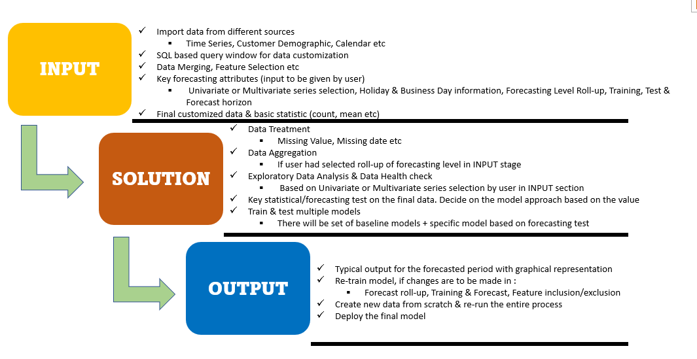

It is an End-to-End solition to automate Time series Forecasting. 

While working on any time series data, we have to go through many Data proprocessing steps followed by statistical tests. Depending on the componenets of timeseries data, one can logically transform the data fit for passing through any forecasting model.
For ex: If Time series data shows Seasonality, one should go forward with any forecasting model that is not able to handle the seasonlity in Data. Along with that, user have to look for optimum seasonal parameters. This has to be done at every steps of statistical test. 

The solution aims to automate all such things. It will preprocess the data under scope, do required statistical analysis, find optimum parameters, model selection and model tuning all under one hood. It will provide the forecast for the input horizon.

Preprocessing steps till now:
- Missing data treatments
- Missing dates treatments
- Roll up options

Statistical Tests till now:
- White noise in data
- Check Stationarity(ADF test)
- Check seaonal component of Data
- Moving average(p), defferencing, Box-cox Transformation, Autoregressive value(q), lograthmic transformation.

Models tested till now:
- ARIMA, ARIMAX
- SARIMA, SARIMAX
- Baseline models(SMA, EA)
- LSTM

Below are the architecture process of software:

